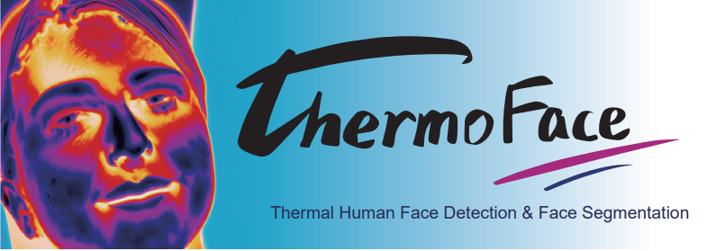
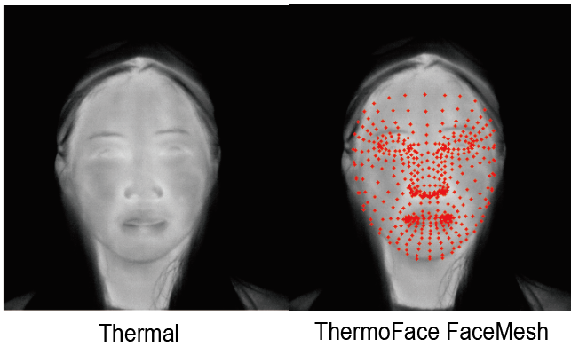

# ThermoFace

<br/>

### ThermoFace code

This repository contains the source code developed for preprocessing Fluke Ti401pro Thermalpicture.IS2 data, ThermoFace detection,and generating ThermoFace matrix. 
Data were collected from 2,881 subjects(2.0 GB).

## Dependencies
### For preprocessing .IS2 data
1. Windows 10
2. MATLAB R2018b
### For ThermoFace detection & ThermoFace matrix generation
1. Windows 10
2. filesplit 4.0.x
3. Python 3.6.x
4. OpenCV 4.5.x. 
5. dlib 19.22.1
6. matlabengineforpython   R2018a
7. mediapipe    0.8.3
8. NumPy: **pip install numpy**
9. Pandas: **pip install pandas**
10. SciPy: **pip install scipy**
11. imutils: **pip install imutils** 
12. face_recognition: **pip install face_recognition**

### Environment has been tested
`ThermoFace.yaml`

## Data Acquisition
Fluke Ti401pro (640 x 480 resolution, Thermal sensitivity ≤0.075 °C at 30 °C target temp) (www.fluke-direct.com) was used for data collection purpose. Ambient temperature (Te) at the time of image acquisition is recorded by the camera. The Fluke system returned IS2-formatted images.
Each Fluke Ti401pro Thermalpicture.IS2 data consisted of **two sessions**. In the **first session**, subjects are the captured the **visible light** images. The **second session** consisted of the paired **thermal light** images , as the **visible light** and **thermal light** data was collected from the same camera positions.


# Description
- **read_data.m**
Matlab codes to turn .IS2 file (raw data of Fluke thermal camera) into visible .png file;
- **codes**
Origin code for ThermoFace detection and matrix build;
- **models**
Training code for SVM thermal face feature points predictor;
Mapmodel.txt is the final thermal facial image location information template;
- **data**
A subfolder of this folder, test_data, holds the .IS2 files used for testing;
User can rename subfolder or create a new folder which contain new thermal images and to test.
- **combine_svm_dat.py**
Merge separated SVM model weight .dat;  
- **main.py**
The main function to generate ThermoFace FaceMesh and Matrix; 


# Usage

### **Step1** Data preprocessing:
#### Create environment
```
conda create -n ThermoFace python=3.6 
conda activate ThermoFace
```
Complete environment configuration like `ThermoFace.yaml`

Download `ThermoFace-main.zip`

Turn to the unpacked folder **./**

run **combine_svm_dat.py/** firstly by
```
python combine_svm_dat.py
```

### **Step2** ThermoFace FaceMesh and Matrix :
- #### Demo usage
Check out how the code we provided works on the example using
```
python main.py
```
- #### Customer usage
Check out how the code we provided works on the example using
```
python main.py -i your_data_folder
python main.py -input your_data_folder
```
`your_data_folder` contains the .IS2 data you want to analysis, and it should be put under folder `./data/`

### **Step3** ThermoFace result check :
-To see origin thermal images: 

```
cd ./rawdata/test_data_result/png
```
- To see ThermoFace FaceMesh images:
```
cd ./rawdata/test_data_result/facemesh
```
- Combined ThermoFace Matrix can be found:
```
cd ./rawdata/test_data_result/tempe
```
**(max,min,std).csv** are the origin data of ThermoFace Matrix.



# ** Cite ThermoFace:**
Cell Metabolism, Yu et al. “Thermal Face Image Analyses Reveal Quantitative Hallmarks of Aging and Metabolic Diseases”  https://cell.com/cell-metabolism/fulltext/S1550-4131(24)00188-8

https://doi.org/10.1016/j.cmet.2024.05.012


# Reference
Lugaresi, C. et al. Mediapipe: A framework for building perception pipelines. arXiv preprint arXiv:1906.08172 (2019).

Abdrakhmanova, M. et al. Speakingfaces: A large-scale multimodal dataset of voice commands with visual and thermal video streams. Sensors 21, 3465 (2021).

# Contact  
For any problems, please contact:  
Zhengqing Yu: yuzhengqing@pku.edu.cn  
Jing-Dong J. Han: jackie.han@pku.edu.cn  
